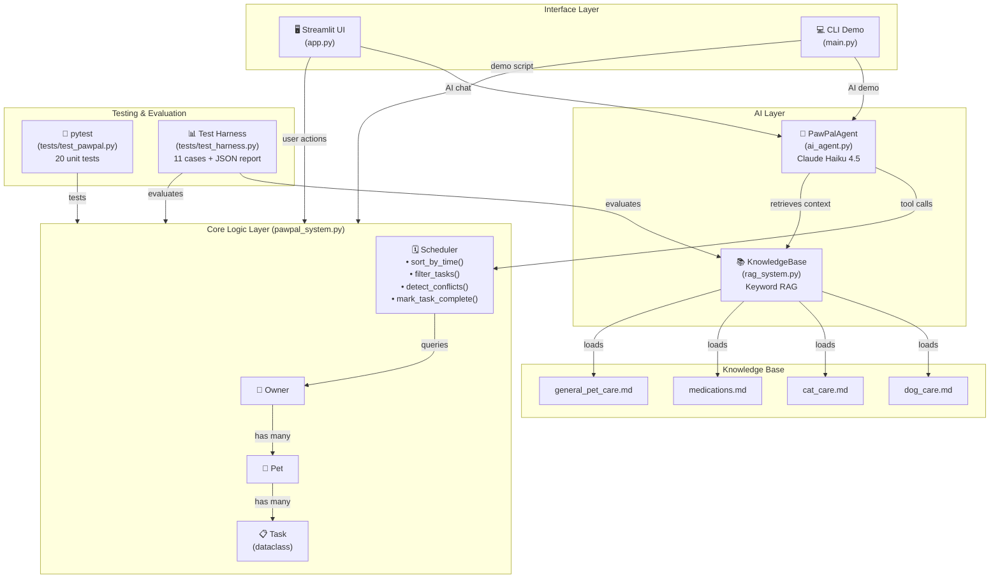

# PawPal+ AI — System Architecture Diagram (Mermaid)

Paste the code block below into https://mermaid.live to render and export as PNG.

```mermaid
flowchart TD
    subgraph UI["Interface Layer"]
        A["🖥️ Streamlit UI\n(app.py)"]
        B["💻 CLI Demo\n(main.py)"]
    end

    subgraph CORE["Core Logic Layer (pawpal_system.py)"]
        C["👤 Owner"]
        D["🐾 Pet"]
        E["📋 Task\n(dataclass)"]
        F["🗓️ Scheduler\n• sort_by_time()\n• filter_tasks()\n• detect_conflicts()\n• mark_task_complete()"]
        C -->|"has many"| D
        D -->|"has many"| E
        F -->|"queries"| C
    end

    subgraph AI["AI Layer"]
        G["🤖 PawPalAgent\n(ai_agent.py)\nClaude Haiku 4.5"]
        H["📚 KnowledgeBase\n(rag_system.py)\nKeyword RAG"]
        G -->|"tool calls"| F
        G -->|"retrieves context"| H
    end

    subgraph KB["Knowledge Base"]
        I["dog_care.md"]
        J["cat_care.md"]
        K["medications.md"]
        L["general_pet_care.md"]
        H -->|"loads"| I
        H -->|"loads"| J
        H -->|"loads"| K
        H -->|"loads"| L
    end

    subgraph TEST["Testing & Evaluation"]
        M["🧪 pytest\n(tests/test_pawpal.py)\n20 unit tests"]
        N["📊 Test Harness\n(tests/test_harness.py)\n11 cases + JSON report"]
    end

    A -->|"user actions"| CORE
    A -->|"AI chat"| G
    B -->|"demo script"| CORE
    B -->|"AI demo"| G
    M -->|"tests"| CORE
    N -->|"evaluates"| CORE
    N -->|"evaluates"| H
```
